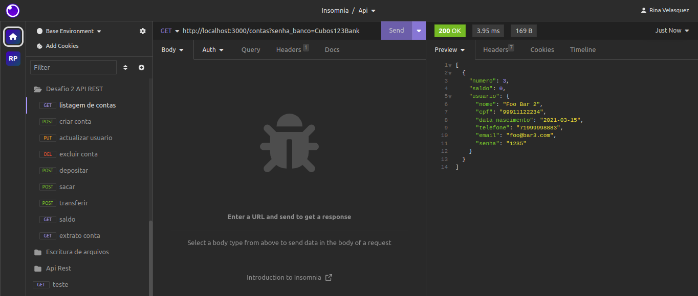

# Desafio Módulo 2 - Back-end

## Sobre
O objetivo do projeto é construir uma RESTful API para um Banco Digital, a idea e colocar en pratica os conhecimentos obtidos no curso com foco Backend da Cubos Academy.
## Descrição do desafio

**Seu papel e desenvolver é criar uma API  que permita:**

-   Criar conta bancária 
-   Listar contas bancárias 
-   Atualizar os dados do usuário da conta bancária 
-   Excluir uma conta bancária 
-   Depósitar em uma conta bancária 
-   Sacar de uma conta bancária
-   Transferir valores entre contas bancárias
-   Consultar saldo da conta bancária
-   Emitir extrato bancário

